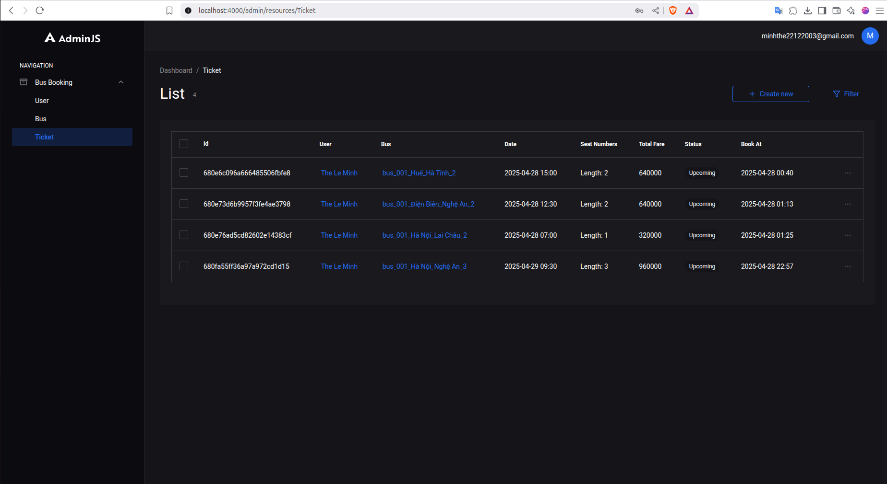

# 🚌 Bus Booking Backend

This is the backend for the **Bus Booking Application** built with **Node.js (Express)** and **MongoDB**. The backend provides the necessary API endpoints for user authentication, bus information management, and ticket booking functionalities.

## 📂 Repository

- **Backend**: [bus_booking_be](https://github.com/leeminhhthee/bus_booking_be)

---

## 🚀 Tech Stack

- **Node.js** with **Express** for the server
- **MongoDB** as the database
- **AdminJS** for the admin dashboard
- **JWT** (JSON Web Tokens) for authentication
- **Google OAuth** for user authentication
- **Mongoose** for MongoDB object modeling

---

## 🔑 Key Features

- User authentication via **Google Sign-In**
- CRUD operations for bus schedules (create, read, update, delete)
- Ticket booking management
- Admin panel using **AdminJS** for managing buses and bookings
- Secure APIs using **JWT authentication**
- Role-based access control for admin and regular users

---

## 🛠️ Installation

### Clone the repository

```bash
# Clone the backend repository
git clone https://github.com/leeminhhthee/bus_booking_be.git
cd bus_booking_be
```

### Install dependencies

```bash
# Using npm
npm install

# OR using Yarn
yarn install
```

---

## 📚 Environment Configuration

1. Create a `.env` file in the project root directory with the following parameters:

  ```env
   # MongoDB URI
   MONGODB_URI=YOUR_MONGODB_URI

   # Google OAuth credentials
   GOOGLE_CLIENT_ID=YOUR_GOOGLE_CLIENT_ID

   # JWT authentication secrets and expiry times
   ACCESS_TOKEN_SECRET=dfdsfsdfds
   ACCESS_TOKEN_EXPIRY=1d
   REFRESH_TOKEN_SECRET=weqedawda
   REFRESH_TOKEN_EXPIRY=30d

   # Cookie password (for session management)
   COOKIE_PASSWORD=432423g23423542trgwrrw5654764sf

   # Admin login credentials for AdminJS panel
   ADMIN_LOGIN_EMAIL=YOUR_EMAIL
   ADMIN_LOGIN_PASSWORD=YOUR_PASSWORD
   ```

2. Save the file as `.env` and update these values ​​to match your environment.

---

### Build and run server

```bash
yarn start
```

## 🔐 Authentication

This backend uses **JWT (JSON Web Tokens)** to secure endpoints. After successful login via Google OAuth, a JWT token is issued to the user. The token must be included in the `Authorization` header for all subsequent requests.

---

## 🎨 Admin Panel

This backend includes an admin dashboard powered by **AdminJS**. To access the admin panel, navigate to:

```
http://localhost:4000/admin
```

Login with the credentials you configured in your `.env` file under `ADMIN_LOGIN_EMAIL` and `ADMIN_LOGIN_PASSWORD`.

---

## 📸 Screenshots

|  |  | 
|----------------|------------------|
|  |  |
|----------------|------------------|

---

## 🧑‍💻 Author

- **Le Minh The**  
  [GitHub Profile](https://github.com/leeminhhthee)

---
